# Hi there, I'm interset-wq 👋

A civil engineering student passionate about building things with code. I love exploring backend development, NLP, and turning ideas into working projects.

## Tech Stack

## GitHub Activity

  

  

  

## Featured Project

  

## What I'm Working On

- **NLP** — Learning natural language processing with Python
- **React Native** — Building mobile apps with Expo
- **Backend** — REST APIs with FastAPI, Flask, and Express
- **Tools** — PDF utilities, static site generators, and more

## Let's Connect

- Email: intersetwq@gmail.com
- freeCodeCamp: [intersetwq](https://www.freecodecamp.org/intersetwq)

> Ship it, learn from it, iterate.
